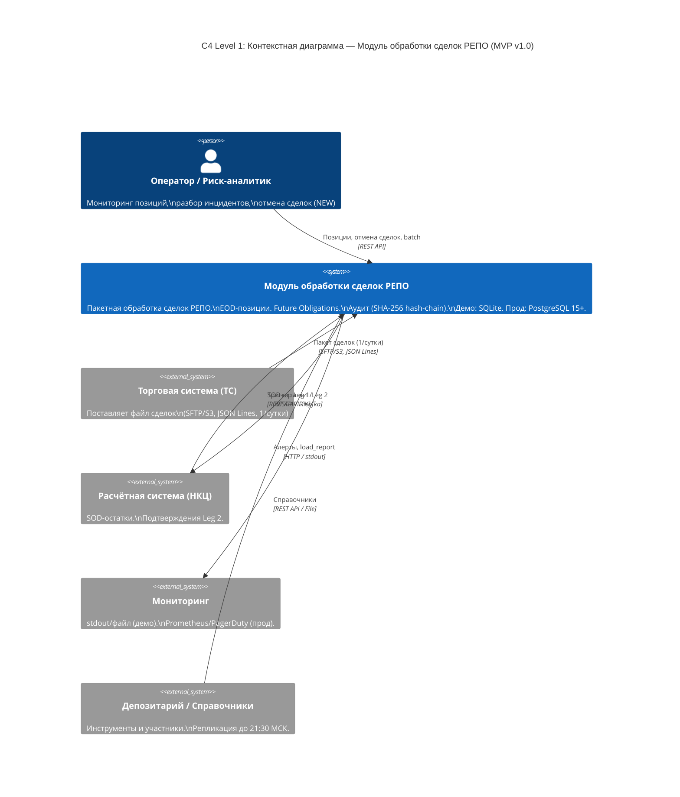
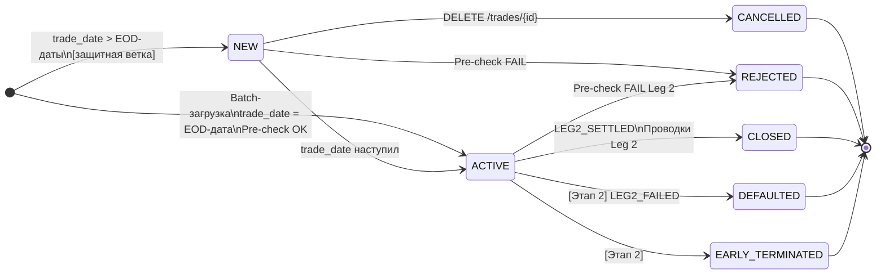
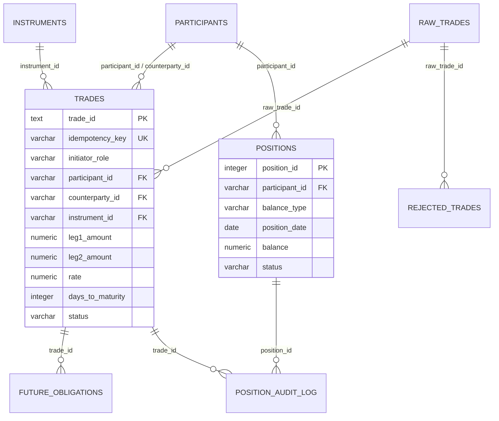

# Модуль обработки сделок РЕПО — MVP

MVP модуля для клиринговой системы по обработке сделок РЕПО (Repurchase Agreement).

**Версия ТЗ:** 1.0 ФИНАЛЬНАЯ | **Дата:** 11 мая 2026

---

## Быстрый старт

### Демо-режим (SQLite, без внешних зависимостей)

```bat
:: 1. Установить зависимости
pip install -r requirements.txt

:: 2. Запустить полный демо-сценарий (генерация данных + обработка 3 дней)
make demo
:: или без make:
python scripts/generate_demo_data.py
set MODE=demo && python scripts/run_demo.py

:: 3. Запустить REST API сервер
make serve
:: или:
set MODE=demo && uvicorn repo_module.api.app:app --host 0.0.0.0 --port 8000 --reload
```

После запуска API доступна документация: http://localhost:8000/docs

### Запуск тестов

```bat
make test
:: или:
set MODE=demo && set SQLITE_PATH=:memory: && python -m pytest tests/ -v
```

---

## Архитектура

```
repo_module/
├── api/
│   ├── app.py          # FastAPI приложение
│   └── routes.py       # REST API эндпоинты
├── batch/
│   └── processor.py    # BatchService: chunked-обработка файлов
├── db/
│   ├── base.py         # SQLAlchemy engine, session management
│   └── orm.py          # ORM модели (PostgreSQL + SQLite совместимые)
├── models/
│   └── domain.py       # Pydantic модели (входные/выходные данные)
├── services/
│   ├── trade_service.py    # TradeService: маппинг ролей, валидация
│   └── position_service.py # PositionService: EOD позиции, pre-check, аудит
├── utils/
│   ├── calc.py         # Расчёт Leg2 (HALF_UP округление)
│   ├── hashing.py      # SHA-256 hash-chain для аудит-лога
│   └── logging_setup.py # Структурированное JSON-логирование
└── config.py           # Конфигурация (demo/production режимы)

scripts/
├── generate_demo_data.py  # Генератор синтетических данных
└── run_demo.py            # Полный демо-сценарий

migrations/
├── postgresql/001_initial_schema.sql  # DDL для PostgreSQL 15+
└── sqlite/001_initial_schema.sql      # DDL для SQLite (демо)

tests/
├── unit/test_calc.py           # Unit-тесты: формула Leg2, маппинг ролей
├── integration/test_batch.py   # Интеграционные тесты: chunked-обработка
└── e2e/test_demo_e2e.py        # E2E тест: полный прогон 3 дней
```

---

## Режимы работы

Переключение через переменную окружения `MODE` или `config.yaml`:

| Параметр | Demo | Production |
|----------|------|------------|
| БД | SQLite (файл или `:memory:`) | PostgreSQL 15+ |
| Источник файлов | `demo_data/incoming/` | SFTP / S3 |
| Логирование | stdout + файл | stdout (→ Kafka) |
| Внешние зависимости | Нет | Kafka, SFTP/S3 |

### Конфигурация

Скопируйте `.env.example` в `.env` и заполните значения:

```bash
cp .env.example .env
```

Ключевые параметры:
```env
MODE=demo          # demo | production
SQLITE_PATH=repo_module.db
API_PORT=8000
```

---

## REST API

Базовый URL: `http://localhost:8000/api/v1/repo`

| Метод | Путь | Описание |
|-------|------|----------|
| GET | `/trades` | Список сделок (фильтры: participant, status, date_from, date_to) |
| GET | `/trades/{id}` | Сделка по UUID |
| DELETE | `/trades/{id}` | Отмена сделки (только NEW, до leg1_settlement_date) |
| GET | `/positions` | Позиции участника |
| GET | `/obligations` | Future Obligations |
| GET | `/reports/eod?eod_date=YYYY-MM-DD` | EOD Position Report (JSON или CSV) |
| GET | `/reports/load/{date}` | Отчёт о пакетной загрузке |
| POST | `/batch/load?eod_date=YYYY-MM-DD` | Ручной запуск загрузки |

---

## Ключевые бизнес-правила

### Маппинг ролей

| initiator_role | participant_id | counterparty_id |
|----------------|----------------|-----------------|
| SECURITY_SELLER | party_1 | party_2 |
| SECURITY_BUYER | party_2 | party_1 |
| отсутствует (fallback) | party_1 (DEFAULT_SELLER) | party_2 |

При отсутствии `initiator_role` применяется fallback `DEFAULT_SELLER` с записью WARNING в лог.

### Формула Leg 2

```
Repo_Income = ROUND(leg1_amount × rate × Days / 365, 2, HALF_UP)
Leg2_Amount = ROUND(leg1_amount + Repo_Income, 2, HALF_UP)
```

Пример из ТЗ: 95 000 000 × 0.165 × 7 / 365 = **300 616.44** → Leg2 = **95 300 616.44**

### Chunked Processing с SAVEPOINT

```
BEGIN TRANSACTION (чанк)
  для каждой записи:
    SAVEPOINT sp_record
    TRY:
      1. Dedup-проверка
      2. Валидация схемы
      3. Маппинг ролей
      4. Pre-check позиции
      5. Вставка в trades
      6. Обновление positions
      7. Создание future_obligations
      8. Запись в position_audit_log
    CATCH (бизнес-ошибка):
      ROLLBACK TO SAVEPOINT → rejected_trades → CONTINUE
    CATCH (системная ошибка):
      ROLLBACK всего чанка → повтор до 3 раз
    RELEASE SAVEPOINT
COMMIT
```

### Эшелонированная защита позиций

1. **Pre-check в коде** (первый рубеж): `IF (balance + delta) < 0 → INSUFFICIENT_BALANCE`
2. **CHECK constraint в БД** (последний рубеж): `CHECK (balance >= 0)` — в SQLite реализован через BEFORE INSERT/UPDATE триггеры

---

## Демо-сценарий

При запуске `make demo` система:

1. Создаёт схему БД SQLite
2. Загружает справочники (16 инструментов, 10 участников)
3. Обрабатывает 3 торговых дня (2026-05-07, 2026-05-08, 2026-05-10)
4. Демонстрирует граничные случаи:
   - Неизвестный инструмент → REJECTED (INSTRUMENT_NOT_ELIGIBLE)
   - Недостаточный баланс → REJECTED (INSUFFICIENT_BALANCE)
   - Нераспознанная роль → REJECTED (INITIATOR_ROLE_UNKNOWN)
   - Отсутствующая роль → WARNING + DEFAULT_SELLER fallback
5. Выводит итоговую статистику
6. Генерирует EOD Position Report CSV в `demo_data/out/`

---

## Тесты

```bat
:: Все тесты
make test

:: Только unit-тесты (формула Leg2, маппинг ролей)
make test-unit

:: Интеграционные тесты (chunked-обработка, изоляция ошибок)
make test-integration

:: E2E тест (полный прогон 3 дней)
make test-e2e

:: С покрытием кода
make test-cov
```

### Покрытие тестами

| Тест | Что проверяет |
|------|---------------|
| `test_example_from_tz` | Точный пример расчёта Leg2 из ТЗ |
| `test_half_up_rounding` | Математическое округление HALF_UP |
| `test_security_seller_mapping` | Маппинг SECURITY_SELLER |
| `test_security_buyer_mapping` | Маппинг SECURITY_BUYER |
| `test_missing_role_fallback` | Fallback DEFAULT_SELLER |
| `test_unknown_role_raises` | Отклонение нераспознанной роли |
| `test_valid_trade_committed` | Успешная регистрация сделки |
| `test_rejected_does_not_affect_valid` | Изоляция ошибок в чанке |
| `test_duplicate_trade_skipped` | Дедупликация по idempotency_key |
| `test_check_constraint_negative_balance` | CHECK constraint на уровне БД |
| `test_insufficient_balance_rejected` | Pre-check недостаточного баланса |
| `test_idempotency_repeated_load` | Идемпотентность повторной загрузки |
| `test_full_demo_3_days` | E2E: полный прогон 3 дней |
| `test_positions_never_go_negative` | Позиции никогда не уходят в минус |

---

## Структура данных

Основные таблицы:

- **`raw_trades`** — неизменяемый журнал входящих записей (append-only)
- **`trades`** — обработанные сделки
- **`positions`** — EOD/SOD позиции участников (с CHECK balance >= 0)
- **`future_obligations`** — реестр будущих обязательств по Leg 2
- **`position_audit_log`** — аудит-лог с SHA-256 hash-chain
- **`rejected_trades`** — отклонённые записи с причиной
- **`load_reports`** — отчёты о пакетных загрузках

---

## Диаграммы архитектуры

Все диаграммы выполнены в нотации C4 и UML (Mermaid). Файлы `.mmd` находятся в корне проекта.

| Файл | Тип | Содержание |
|------|-----|------------|
| [`d1_c4_context.mmd`](d1_c4_context.mmd) | C4 Level 1 | Контекстная диаграмма: внешние системы и акторы |
| [`d2_c4_container.mmd`](d2_c4_container.mmd) | C4 Level 2 | Контейнеры: API, BatchProcessor, сервисы, БД |
| [`d3_state_trade.mmd`](d3_state_trade.mmd) | UML State | Жизненный цикл сделки РЕПО |
| [`d4_seq_batch.mmd`](d4_seq_batch.mmd) | UML Sequence | Ночная пакетная загрузка (чанки, SAVEPOINT) |
| [`d5_er_model.mmd`](d5_er_model.mmd) | ER-диаграмма | Модель данных: все таблицы и связи |
| [`d6_flow_eod.mmd`](d6_flow_eod.mmd) | Flowchart | EOD-расчёт позиций: SOD → Leg1 → Leg2 → отчёт |
| [`d7_seq_record.mmd`](d7_seq_record.mmd) | UML Sequence | Обработка одной записи внутри SAVEPOINT |
| [`d8_c4_component.mmd`](d8_c4_component.mmd) | C4 Level 3 | Компоненты модуля и их зависимости |

### D1 — Контекстная диаграмма (C4 Level 1)



### D3 — Жизненный цикл сделки (UML State)



### D5 — ER-модель данных



---

## Roadmap (Этап 2, вне MVP)

- Realtime-обработка через Kafka
- REST API POST /trades для внешних систем
- Досрочное исполнение (Early Termination)
- Автоматическая обработка дефолтов
- Margin Call / Mark-to-Market переоценка
